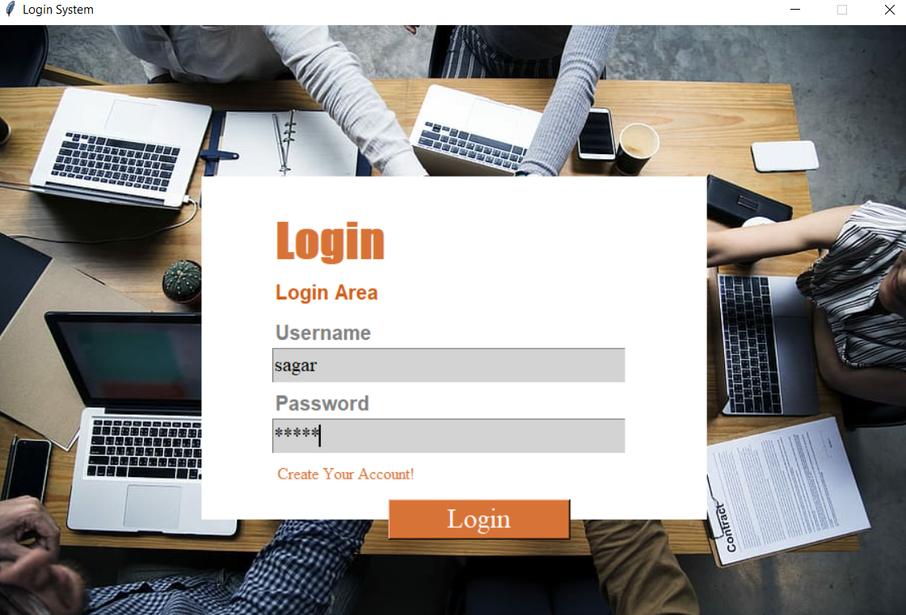
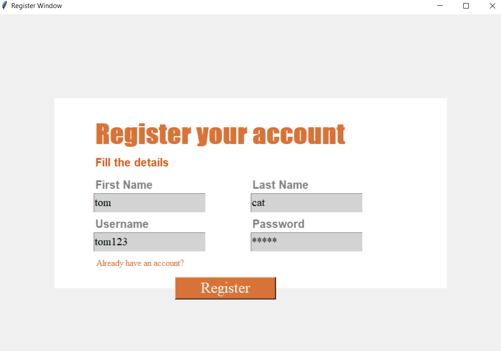
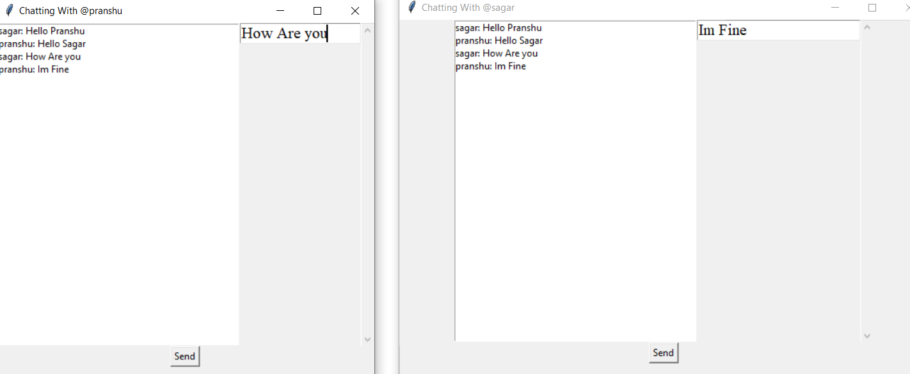
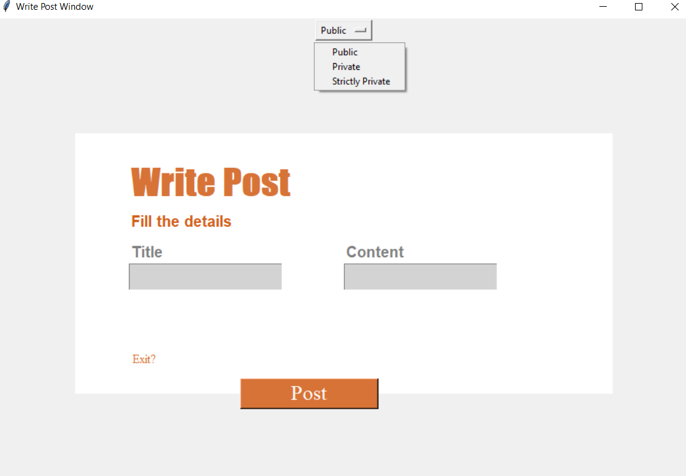
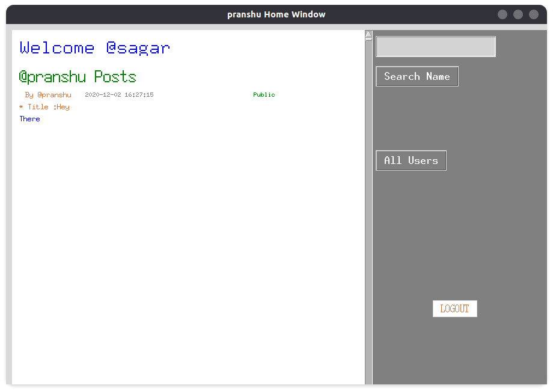
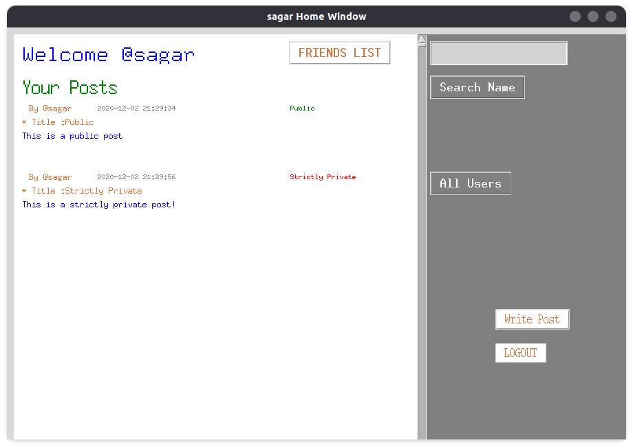
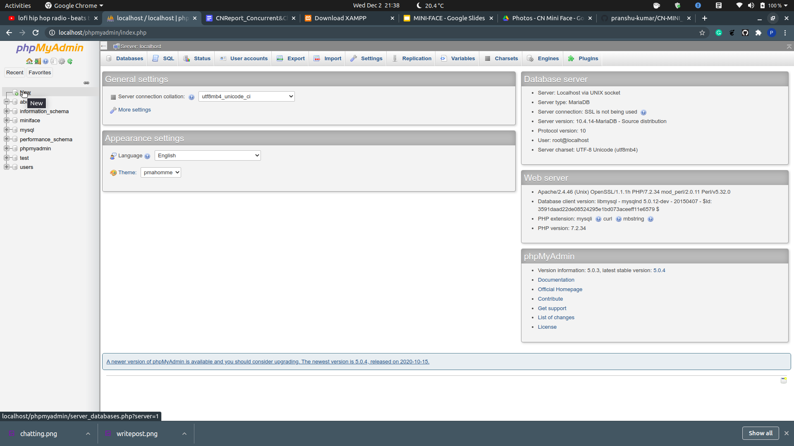
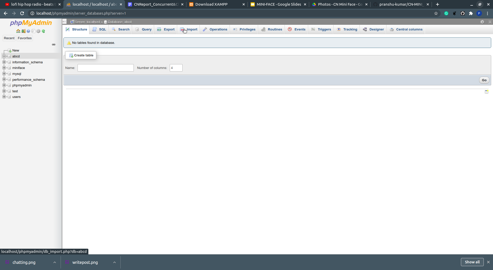

# MINI-FACE APP
A Facebook clone made as part of the course project of the course **CS 433: Computer Networks** offered at **IIT Gandhinagar**. The app uses basic networking paradigms and mimics the basic functionalities and features of Facebook

## Features Offered
Here is the list of features that have been employed in our application. 
1. Basic Features
    1. **User Authentication** - Clients are able to register with our application, they can also login and logout of Mini-Face. The users can only access the other features of Mini Face if they are logged in. 
    2. **Social Network** - The users of Mini-Face will be able to search other registered users. They can send and accept friend requests and can also initiate a chat session with them. The active user can also visit other user’s walls and see their public posts.
1. Advanced Features
    1. **Concurrent Server** - Our implementation of the server is concurrent in nature which means that multiple clients can send and receive information to and from the server simultaneously. 
    2. **Posts** - The users of Mini-Face can also write posts and upload them. These posts can also be assigned and ownership i.e. posts can be categorized as public, private and strictly private. The public posts are the ‘visible’ posts. private are only visible to friends and strictly private are only visible to their authors. 
    3. **Storage of Messages and Posts** - The messages with other users and uploaded posts and posts of other users are all stored in the database that we have created. With the help of this, the user can read previous chat messages and  also look at previously uploaded posts.
    4. **Security Features** - When the user enters his/her password, it will be masked with ‘*’. The password will be then encrypted by using the cryptography module in python. It will generate a unique key id through which encryption and decryption of the password will take place. The database will then only store these encrypted passwords and not the original one.
    5. **GUI** - A robust implementation of a Facebook is nothing without a good GUI! Thus, we back our implementation with an easy to use GUI that can help the user navigate through the proposed features easily.

## Instructions
Clone the repository and run the following commands in the terminal:
### Creating a new conda environment
```shell
$ conda create --name <env_name>
$ conda activate <env_name>
```
> You can create a new environment using `vitualenv` too
### Installing libraries from requirements.txt
```shell
$ pip install -r requirements.txt
```

### Setting up the database
For this you'll require the MySQL server setup. You can install <a href="https://www.apachefriends.org/download.html" target="_blank">xampp</a> and start a MySQL server in your local machine. 

Once this is done, you need to import the [miniface.sql](miniface.sql) file in your database and you're done!

##### Step 1
After starting the MySQL server, go to `localhost/phpmyadmin page` and click on **new**


##### Step 2
Give the name **'miniface'** to the database


##### Step 3
Click on **'import'** and import the file [miniface.sql](miniface.sql)


### Setting up the main application
For starting the server, 
run [start_server.py](start_server.py) and for starting the main application, start [main.py](main.py)
